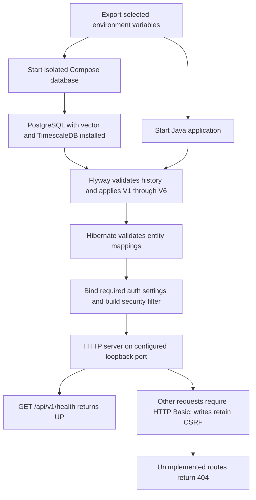

# Checkpoint: PRD Phase 1 infrastructure
Date: 2026-09-09
Status: Implemented. Java 21 tests, database migration/upgrade, executable packaging and local HTTP smoke checks passed. Remote GitHub CI has not run.

## Purpose and result
Restore a coherent infrastructure baseline from a checkout whose earlier pipeline implementations had been removed. The application now starts with only PostgreSQL and application credentials. It does not require an OpenAI key, SEC settings or an authenticated broker.

Phase 1 includes Java 21, PostgreSQL 16 with pgvector and TimescaleDB, Flyway-managed schema, core JPA entities, required authentication, an explicit minimal liveness endpoint and separate unit/integration test execution. No forecasting or ingestion endpoint is implemented.

## High-level flow



This is a conceptual startup dependency flow, not a guarantee of Spring bean initialization order. A database, migration, mapping or required-auth error fails startup. Liveness reports process availability after startup, not continuous database readiness.

Persistence foundation:
```text
Stock (existing table)
  ├─ StockIdentifier: type/value + source + effective interval + recordedAt
  │     findKnownAt(type, value, asOf) excludes future knowledge
  └─ IngestionRun: provider/dataset + start/completion + status/count
        RUNNING → SUCCEEDED or FAILED exactly once
```

There is no job producing ingestion runs yet; tests exercise the foundation with explicitly synthetic values.

## Exact changes
| File or group | Change and purpose |
| --- | --- |
| pom.xml | Java target 17 → 21; PostgreSQL JDBC explicit; kept Web MVC, JPA, Security, Validation and Flyway; removed unused MySQL, Spring AI/OpenAI/vector/JSoup, Docker auto-start, TwsApi/protobuf and Lombok dependencies; integration test profile |
| compose.yaml | Separate ragdemo-phase1 project/database service, loopback default port 5433, persistent named volume, health check and digest-pinned official Timescale PostgreSQL 16 image with pgvector |
| .env.example | Non-secret, replace-before-use variable template |
| RagDemoApplication.java | Removed import/registration of missing IBKRProperties |
| application.yaml | Explicit database/auth variables, loopback binding, Flyway ownership, Hibernate validate, no automatic .env/provider configuration |
| config/AppAuthProperties.java; config/SecurityConfig.java; controller/HealthController.java | Required auth binding, redaction, filter/user/encoder beans, minimal liveness |
| stock/*.java; ingestion/*.java | Core entities and repositories; temporal identifier lookup and ingestion-state constraints |
| V6__infrastructure_foundation.sql | Additive extension/identifier/provenance migration; V1–V5 preserved |
| src/test/java/project/ragdemo/config/, ingestion/, stock/ | New security/binding, domain, SQL persistence, temporal-filter and migration-upgrade tests |
| RagDemoApplicationTests.java | Replaced empty context check with actual migration/extension assertions; marked integration |
| archive/pre-prd/ | Moved 11 prior-pipeline Java tests, 2 test resources and 2 monitor assets; original paths and SHA-256 hashes recorded in manifest.json |
| ../.github/workflows/ragdemo-phase1.yml | CI at actual Git repository root; scoped to RAGDemo changes; Java 21, isolated database and complete integration verify |
| Documentations/ArchitectureAssessment.MD | Starting checkout and accepted scope |
| Documentations/Phase1Database.MD | Exact database/entity/repository methods, schema and tests |
| Documentations/Phase1Security.MD | Exact config/controller methods, security and tests |
| Documentations/MultiAgentPlan.MD | New PRD milestones with implemented and planned work separated |
| Documentations/skills/*/SKILL.md | Scoped database and security sub-agent instructions |
| This document | Flow, settings, runbook, validation and limitations |

Paths above are relative to the project unless the Git-root workflow is explicitly indicated. Java groups are under src/main/java/project/ragdemo; SQL is under src/main/resources/db/migration.

No git commits, resets, checkouts or staging were performed. The pre-existing staged deletions were not reset. Re-created classes at earlier deleted paths appear separately in the working tree until the user stages the final change.

### Legacy reconciliation
The 11 old tests referenced classes missing before this task. Their source and fixture/monitor files were moved byte-for-byte into archive/pre-prd, not rewritten as passing tests. Maven does not compile that archive. manifest.json records all 15 files and hashes; hashes were verified after moving. Old monitor assets are no longer served without their missing backend. This archive is reference material for future phases, not evidence of current coverage.

### Method-level record
Every new/changed application method and test method is listed in [Phase1Database.MD](Phase1Database.MD) and [Phase1Security.MD](Phase1Security.MD). Configuration-only changes are described here; no training/provider/service methods were added.

## Adjustable variables and policies

| Setting | Default / requirement | Effect |
| --- | --- | --- |
| JAVA_HOME | JDK 21+ installation | Maven/runtime JDK; pom.xml compiles for Java 21 |
| POSTGRES_HOST | localhost | Application database host; Compose publishes locally |
| POSTGRES_PORT | 5433 | Host database port for application and Compose |
| POSTGRES_DB | ragdemo | Database name |
| POSTGRES_USER | ragdemo | Database login |
| POSTGRES_PASSWORD | Required | Database password; no production value is committed |
| APP_AUTH_USERNAME | Required, nonblank | HTTP Basic username |
| APP_AUTH_PASSWORD | Required, nonblank | HTTP Basic password, independent from database password |
| SERVER_ADDRESS | 127.0.0.1 | HTTP bind address |
| SERVER_PORT | 8080 | HTTP listening port |
| Maven -Pintegration | Off by default | Include database-tagged tests along with unit tests |
| docker compose -p NAME | ragdemo-phase1 | Isolate containers, network and volume under another project name |
| compose.yaml image | pg16 plus pinned SHA-256 | Database/extension distribution; changing it requires upgrade compatibility review |
| Compose healthcheck | 5s interval/timeout; 20 retries | Database readiness wait |
| Compose restart | unless-stopped | Container restart policy |
| spring.flyway.baseline-on-migrate | false | Refuse to silently baseline a populated untracked schema |
| spring.flyway.clean-disabled | true | Disable Flyway clean |
| spring.jpa.hibernate.ddl-auto | validate | Detect mapping mismatch; do not create/update schema |
| spring.jpa.open-in-view | false | Do not keep persistence context open through HTTP rendering |
| hibernate.jdbc.time_zone | UTC | JDBC timestamp convention |
| Ingestion error-summary bound | 1000 characters | Domain validation and SQL column length; requires coordinated code/schema change |
| Identifier effective interval | [validFrom, validTo) | End is exclusive; recordedAt must also be <= asOf |

There are no active model, embedding, broker, SEC or forecasting-horizon settings in Phase 1. Image version/digest and schema policies are deliberately file-controlled rather than arbitrary runtime toggles.

For the official image, installed database passwords are attached to the initialized volume: changing an environment variable alone does not change an existing database user's password. New test environments should use a separate Compose project/volume or deliberate credential administration; do not delete a data volume to solve configuration confusion.

## Local runbook

Requires JDK 21+ and Docker with Compose. From RAGDemo:

```sh
cp .env.example .env.phase1
# Edit .env.phase1 and replace both placeholder passwords.
set -a
source .env.phase1
set +a
docker compose --env-file .env.phase1 up -d --wait database
./mvnw test
./mvnw -Pintegration verify
java -jar target/RAGDemo-0.0.1-SNAPSHOT.jar
```

The .env.phase1 file is ignored by Git. Spring does not import it automatically; sourcing exports it for Maven/Java. Compose can read it via --env-file. No default local password is supplied by application configuration.

In another terminal:

```sh
curl http://127.0.0.1:8080/api/v1/health
```

Expected body: {"status":"UP"}. Stop the app with Ctrl-C. Stop the selected database project with docker compose --env-file .env.phase1 stop database; named-volume data remains.

This session's validation database is still running on 5433 with its own volume. Its temporary credentials are in /tmp/ragdemo-phase1.env (owner-readable only). To reuse it, source that file and pass it to Compose instead of .env.phase1. The temporary JDK is /tmp/ragdemo-jdk21/Contents/Home. No system Java installation or existing port-5432 database was changed.

## Validation record

- Initial compile passed.
- Initial unit run found missing HttpSecurity in the Web MVC test slice; explicit EnableWebSecurity fixed it.
- Default unit suite: 9 passed.
- Initial integration run successfully applied V1–V6 and passed repository checks, but the binding test inherited environment auth values. Test-only environment isolation fixed this.
- Clean Java 21.0.12.1 run: 16 tests passed, 0 failed/errors/skipped. Includes V5 upgrade preservation and repeated migration no-op.
- That offline verify then failed at packaging because Maven plugin dependencies were not cached. Downloaded required packaging dependencies and reran package with tests skipped; executable jar build passed. Test success and packaging success are distinct results.
- Final Java 21 offline -Pintegration verify passed end to end: **17 tests, 0 failures/errors/skips**, plus executable packaging. Negative-count and missing-completion database constraints are checked independently.
- Real packaged Java 21 application started on localhost:18080 with database/auth credentials only. Health returned 200/UP; unauthenticated protected route 401; authenticated unimplemented route 404. Test server shut down gracefully afterward.
- Both SKILL.md files passed the official skill validator after installing PyYAML in a temporary virtual environment.
- Compose/application/CI YAML parsed; archive hashes verified; git diff --check passed.
- GitHub workflow installed at Git root and inspected locally; remote CI execution has not occurred.
- No OpenAI/IBKR/SEC requests, model generation, forecast evaluation or historical market imports were used for Phase 1 validation.

Logs: /tmp/ragdemo-phase1-compile.log, /tmp/ragdemo-phase1-unit.log, /tmp/ragdemo-phase1-integration.log, /tmp/ragdemo-phase1-java21.log, /tmp/ragdemo-phase1-package.log, /tmp/ragdemo-phase1-app.log, /tmp/ragdemo-phase1-final.log.

## Delegation and skills
Two sub-agents were authorized and started with explicit SKILL.md paths:
- phase1-database: additive schema, stock/identifier/ingestion entities and repositories.
- phase1-security: application configuration, auth beans and health controller.

Both reached usage limits after writing partial implementation files. The parent inspected those files, finished the implementation and tests, performed all final validation, and authored these records. No sub-agent completion claim was treated as validation. The skills are repository-local task instructions passed by path, not installed global skills. Their YAML frontmatter and content passed the supplied validator.

## Remaining work
Phase 2 is next: reproducible provider adapters and historical daily data with corporate actions, gaps and availability timestamps. Phase 1 does not establish stock-forecast quality, market access, retrieval quality or complete historical security resolution. The old single-company CIK uniqueness requires deliberate review before multi-share-class coverage.

The CI workflow is prepared but unexecuted remotely. Shared deployment, persistent multi-user identity and TLS remain separate deployment work. No automatic trading is implemented.

References used for infrastructure contract verification:
- [Timescale official Docker image repository](https://github.com/timescale/timescaledb-docker-ha)
- [Adoptium official CI download API](https://adoptium.net/installation/ci-scripts/)
- [GitHub setup-java action](https://github.com/actions/setup-java)
- [GitHub checkout action](https://github.com/actions/checkout)
