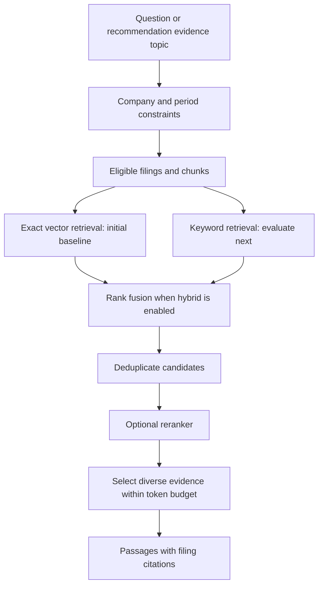

# Retrieval strategy research and decision

Research date: 2026-09-09  
Status: filtered exact vector retrieval is implemented and covered by correctness tests.
Hybrid retrieval and a model-based reranker remain proposed; retrieval quality has not been benchmarked.

## Decision

Start with **filtered exact vector search** as the measurable baseline. Design the
pipeline so it can add **keyword retrieval with rank fusion** and an **optional
reranker**. Enable those additions when evaluation shows that they improve evidence
selection within the application's latency budget.

The recommended target is filtered hybrid retrieval followed by reranking. The
first implementation is deliberately smaller: filtering and vector search establish
whether the stored chunks can retrieve useful evidence at all.

A reranker is a proposed second-stage improvement, not a proven requirement for
this dataset. No reranker provider or model has been selected.

## 1. What was examined

The research started with the local [project requirements](../PRD_Stock_Recommendation_Engine_v3.md)
and [RAG design notes](RAG.md), then checked primary technical sources against the
existing ingestion and storage design.

| Project observation | Retrieval implication |
|---|---|
| Recommendations start from a ticker and must cite evidence. | Company scope and filing provenance must accompany every result. |
| Filings have filing dates, report dates, types, accession numbers, and ingestion status. | Use relational metadata to constrain eligible evidence. |
| Chunks preserve section metadata and have 1536-dimensional embeddings. | Vector retrieval can reuse the current data; section information can guide evidence selection. |
| Chunks overlap by 500 characters. | Remove redundant results before constructing the answer context. |
| The checked AAPL 10-K contained 99 chunks. | Begin with exact search over eligible chunks; measure before adding approximate indexes. This is one filing's size, not a measurement of the entire corpus. |
| The PRD targets p95 recommendation latency below five seconds. | Extra model calls need an explicit latency and quality evaluation. |
| The HTML parser emits table-cell text rather than structured financial tables. | Passage retrieval alone cannot guarantee correct numerical comparisons. |

The sources were used to understand mechanisms and tradeoffs. No comparative
retrieval experiment was run on this project's filings during this research.

## 2. Sources and what they contributed

1. **pgvector documentation** describes exact and approximate vector search,
   cosine distance, filtering, and combining vector retrieval with PostgreSQL
   full-text search. It identifies Reciprocal Rank Fusion and cross-encoders as
   ways to combine results. This supports building the retrieval pipeline in the
   current database rather than introducing another search service.
   [Source](https://github.com/pgvector/pgvector)

2. **PostgreSQL 16 text-search documentation** explains lexical matching and the
   built-in `ts_rank` and `ts_rank_cd` functions. This establishes a readily
   available keyword-search option. These functions are not BM25, so a PostgreSQL
   full-text implementation should not be described as BM25 retrieval.
   [Source](https://www.postgresql.org/docs/16/textsearch-controls.html)

3. **Anthropic's contextual retrieval research** explains why isolated chunks can
   lose company or period context, how lexical and semantic retrieval complement
   one another, and how reranking can improve selection from a larger candidate
   pool. Its experiments motivate evaluating these techniques; their results do
   not establish an expected accuracy improvement for this project.
   [Source](https://www.anthropic.com/engineering/contextual-retrieval)

4. **SEC API documentation** describes structured company-concept and company-facts
   data. This supports a separate numerical-data path for financial calculations
   instead of relying on flattened prose and table cells for every answer.
   [Source](https://www.sec.gov/search-filings/edgar-application-programming-interfaces)

## 3. Strategies considered

The fit assessments below are engineering judgments based on the project and the
sources above, not benchmark results.

| Strategy | Main benefit | Limitation | Decision for this project |
|---|---|---|---|
| Unfiltered vector search | Finds semantically related passages. | Similar passages from the wrong company or period may rank highly. | Do not use as the default evidence path. |
| Filtered vector search | Finds related passages within eligible filings. | Similarity alone may miss exact terminology or favor generic passages. | Implement first as the baseline. |
| Keyword search | Matches specific financial terms, names, and phrases. | Different wording can hide relevant evidence. | Evaluate alongside vector search. |
| Hybrid search | Combines semantic and lexical candidates. | Requires query handling, rank fusion, and additional evaluation. | Recommended next retrieval improvement. |
| Reranking | Reorders candidates by question–passage relevance. | Adds computation or an API call; cannot recover evidence never retrieved. | Evaluate as an optional second stage. |
| Context expansion | Adds nearby text to explain a matched passage. | Can enlarge context and introduce repetition. | Add selectively if evidence is incomplete. |
| Query decomposition | Searches separately for different evidence needs. | Adds searches and requires a coverage policy. | Useful for broad stock recommendations. |
| Contextual embeddings | Adds document context before embedding chunks. | Changes ingestion and requires re-embedding existing chunks. | Defer until evaluation identifies missing-context failures. |

Filtering, retrieval, and reranking are complementary stages rather than mutually
exclusive alternatives. Filtering determines what is eligible; retrieval finds
candidates; reranking orders those candidates.

## 4. Why filtered vector search comes first

### Correct scope is part of correctness

For a question about Apple's risks in a particular period, a highly similar
passage about another company or a later year is unsuitable evidence. Semantic
similarity does not enforce the requested company or publication cutoff.

The initial search should restrict eligible chunks using:

- The requested company, resolved consistently to ticker/CIK.
- `ingestion_status = 'EMBEDDED'` and a non-null embedding.
- Requested filing types, accession numbers, or reporting periods when supplied.
- A publication cutoff for historical queries.
- Section constraints only when the question explicitly requires them; otherwise
  section information can guide ranking without excluding useful evidence elsewhere.

Apply equivalent constraints to both branches if keyword search is added. Do not
retrieve a global top-K list and only then discard wrong-company results in Java.

`report_date` describes the reported period; `filing_date` describes the filing
date. They are not interchangeable. Exact historical backtesting will require an
availability policy and SEC acceptance timestamps beyond the current date-only
schema. Until then, do not claim intraday point-in-time correctness.

### Existing data supports a simple baseline

The stored embeddings can be compared with an embedding of the question using
the same model and dimensions. Cosine distance provides an initial ranking, and
the existing filing/chunk relationship supplies citation metadata.

Start with exact search because the filtered working set may be small. pgvector
documents exact search as its default; approximate indexes trade some nearest-
neighbor recall for speed. Exact nearest-neighbor recall does not mean perfect
semantic relevance. Add HNSW only after measuring latency and retrieval quality.
If approximate search is introduced, also evaluate its interaction with filters.
[Source](https://github.com/pgvector/pgvector#indexing)

## 5. Why a reranker is worth evaluating

The initial vector search answers: **Which chunks are nearby in embedding space?**
A reranker then evaluates the question together with each candidate passage to
produce a more focused relevance ordering.

For example, for “What could reduce Apple's operating margin?”, candidate passages
might include general risk disclosures, historical margin descriptions, and a
specific explanation of input costs or product mix. A useful reranker would move
the directly explanatory evidence above merely related material. This is an
illustrative expectation, not an observed result from our corpus.

Reranking offers a way to retrieve a broader candidate pool while passing fewer,
better passages to answer generation. Anthropic's experiments support testing that
approach, but also discuss the cost and latency tradeoff.
[Source](https://www.anthropic.com/engineering/contextual-retrieval)

The decision is conditional:

- Keep the baseline and reranked paths comparable on the same questions.
- Enable a reranker if it consistently improves the relevance of the final
  evidence set and fits the end-to-end latency budget.
- Retain the baseline if improvements are negligible or latency is excessive.
- Do not interpret reranker or vector scores as probabilities that a stock
  recommendation is correct.

A reranker cannot fix missing filings, incorrectly parsed tables, wrong metadata,
or relevant chunks absent from its candidate pool. Candidate recall and ingestion
quality must be evaluated separately.

## 6. Where hybrid search fits

Vector search helps with conceptual wording such as “pressure on profitability.”
Keyword search can help when a question names terms such as “share repurchases,”
specific products, or accounting concepts.

The proposed hybrid implementation uses PostgreSQL full-text search over content
and section titles, alongside pgvector cosine search. It merges results with
Reciprocal Rank Fusion (RRF), then removes duplicate chunk IDs. RRF combines rank
positions instead of directly adding lexical and vector scores with different
scales. pgvector documents this combination.
[Source](https://github.com/pgvector/pgvector#hybrid-search)

Keyword query construction needs evaluation too: passing a long natural-language
question as a conjunction of all its terms can be overly restrictive. Company
and date constraints belong in metadata filters rather than depending on those
words appearing in every chunk.

An initial experiment could retrieve 20 candidates from each branch and return
5–8 final passages. These counts are tuning starting points, not measured optima.
Budget by total context tokens as well as passage count because current chunks
can be approximately 4000 characters long.

## 7. Proposed architecture

For a ticker-only recommendation, prepare focused evidence searches for business
performance, profitability, liquidity, risks, and material changes. A single broad
query such as “Should I buy AAPL?” is not an adequate evidence-coverage policy.
Multi-period comparisons should explicitly retrieve evidence for each requested
period rather than rely on one global top-K list.

Each result should include the chunk ID, accession number, company, filing type,
filing/report dates, section, original text, and source URL. Preserve provenance
through fusion, reranking, and any context expansion. A filing URL is a document
citation; the current chunk character offsets should not be presented as precise
positions in the original HTML.

For exact numerical questions, plan a separate structured SEC XBRL/quantitative
data path. Preserve units, periods, and filing provenance and calculate changes
in code. Text retrieval supplies explanatory evidence alongside those figures.
[Source](https://www.sec.gov/search-filings/edgar-application-programming-interfaces)

## 8. Evaluation and implementation order

Build a small labeled question set before selecting a reranker. Include paraphrased
questions, exact financial terms, historical cutoffs, comparisons across periods,
overlapping passages, and questions the stored filings cannot answer.

| Stage | Implementation | Evidence needed to move forward |
|---|---|---|
| 1 | Filtered exact vector search with citations. | Correct company/period scope and useful candidate recall. |
| 2 | Keyword search plus RRF. | More relevant evidence than the vector baseline on the labeled set. |
| 3 | Optional reranker over the same candidate pool. | Better final ordering without exceeding the latency budget. |
| 4 | Context expansion, contextual embeddings, or HNSW as needed. | Specific measured failures or performance bottlenecks justify each addition. |

Measure:

- **Recall@K:** whether expected evidence enters the candidate pool.
- **Precision@K or nDCG@K:** whether the final passages are relevant and well ordered.
- **Scope correctness:** whether company and period constraints are respected.
- **Redundancy and coverage:** whether overlap crowds out distinct evidence topics.
- **Citation integrity:** whether returned text remains traceable to stored filings.
- **No-evidence behavior:** whether unsupported questions avoid forced answers.
- **Latency and cost:** embedding, database search, reranking, and total generation,
  including p95 latency against the PRD's five-second target.

This sequence keeps the decision testable: filtered vector search establishes the
baseline; hybrid retrieval broadens candidate discovery; reranking must demonstrate
that it improves selection from those candidates.
